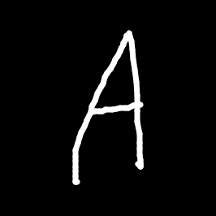
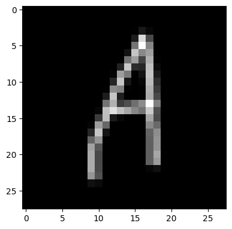

# 📝 Handwritten Letter Recognition with EMNIST

This project builds a deep learning model that recognizes handwritten English letters (A–Z) using the [EMNIST Balanced dataset](https://www.nist.gov/itl/products-and-services/emnist-dataset). It explores multiple model architectures and preprocessing techniques (like Otsu's thresholding) to improve accuracy.

---

## 📌 Project Highlights

- 🔍 **Custom Otsu Thresholding**: Your own handcrafted image binarization logic (no OpenCV used!)
- 🧱 **CNN Model**: A multi-layer convolutional neural network trained for 27 Turkish characters.
- 🧪 **Prediction Ready**: Easily run predictions on new handwritten letter images.
- 🧼 **Modular Codebase**: Structured into `src/` for maintainability and reuse.

---

## 🗂️ Folder Structure

```
handwritten-letter-recognition-model/
├── models/                      # Pretrained model weights
├── notebooks/                  # Training + experimentation notebooks
├── plot-images/                # Visualizations
├── samples/                    # Example images for prediction
├── src/
│   ├── model.py                # CNN architecture
│   ├── predict.py              # Single-image inference
│   ├── train.py                # Training loop (modularized)
│   └── image_processing.py     # Image processing utilities
├── otsu.py                     # Your custom Otsu thresholding method
├── test.py                     # Example usage script
├── requirements.txt
└── README.md
```

---

## 🚀 Getting Started

### 1. Clone the Repository

```bash
git clone https://github.com/haldonmez/handwritten-letter-recognition-model.git
cd handwritten-letter-recognition-model
```

### 2. Set Up Virtual Environment

```bash
python -m venv venv
source venv/Scripts/activate   # or .\venv\Scripts\activate on Windows
pip install -r requirements.txt
```

---

## 🔍 Inference Example

You can run a prediction on a handwritten letter image using the trained model and your custom thresholding.

### 📄 `test.py`

```python
from src.predict import load_model, predict_image

# Load the trained model
model = load_model("models/emnist_model_4_ver2.pth", input_size=1, output_size=27)

# Predict on a sample image
predicted_class, confidence = predict_image(model, "samples/last_inverted_cropped.png")

print(f"Predicted class: {predicted_class}")
print(f"Confidence: {confidence*100:.2f}%")
```

### ▶️ Run the script

```bash
python test.py
```

### ✅ Sample Output

```
Predicted class: 1
Confidence: 98.89%
```


<br/>
Predicted Output: A

> Make sure the model and input image exist at the paths specified:
> - `models/emnist_model_4_ver2.pth`
> - `samples/last_inverted_cropped.png`

---
## 🧠 Custom Thresholding – `otsu.py`

This project uses a handcrafted image thresholding method, inspired by **Otsu's algorithm**, implemented entirely using **NumPy and PyTorch** (without OpenCV).

### 🔍 What It Does

The `findGreatestThreshold()` function takes in a grayscale image (as a NumPy array) and:

1. **Flattens the image**
2. **Calculates pixel intensity histogram** (in 6 bins)
3. **Iterates through threshold candidates**
4. **Computes between-class variance** using custom math
5. **Selects the threshold with the highest variance**
6. **Returns a binarized (black-and-white) version of the image**

### 📄 Source File: `otsu.py`

```python
from otsu import findGreatestThreshold

thresholded_image = findGreatestThreshold(grayscale_image)
```

### ✅ Example Use in This Project

In `predict.py`, we use this function to binarize the input image before classification:

```python
from otsu import findGreatestThreshold

image = Image.open("samples/sample.png").convert("L")
image_np = np.array(image)
thresholded = findGreatestThreshold(image_np)
```
<p align="center">
  
  
</p>

> This custom implementation is useful when you want control over preprocessing logic and avoids dependency on OpenCV.

---

## 🧠 Model Architecture

This project uses a custom deep CNN architecture defined in [`src/model.py`](src/model.py).

### Highlights:
- 3 Convolutional Blocks (32 → 64 → 128 filters)
- BatchNorm, MaxPooling, Dropout at each stage
- 3 Fully Connected Layers (512 → 256 → output classes)
- Dropout regularization to reduce overfitting

### To reference the model architecture:
```python
from src.model import get_model

model = get_model() # Defaults: input_size=1, 
                    # output_size=27  
                    # 26 English letters + 1 for blank
```
---

## 🧠 Model Training Overview

Training was conducted over multiple experiments (`notebooks/emnist_model_*.ipynb`). Each version focused on optimizing:

- Batch size, dropout, learning rate
- Preprocessing methods (inversion, resizing, binarization)
- Model architecture changes (CNN layers, dense size)

Plots are available in [`plot-images/`](plot-images/) for visual reference.

---

---

## 📁 Resources

- Dataset: [EMNIST Balanced (by NIST)](https://www.nist.gov/itl/products-and-services/emnist-dataset)
- Otsu Thresholding: [Wikipedia](https://en.wikipedia.org/wiki/Otsu%27s_method)

---

## 🧑‍💻 Author

Made by [haldonmez](https://github.com/haldonmez)

---

## 📄 License

This project is licensed under the MIT License.
